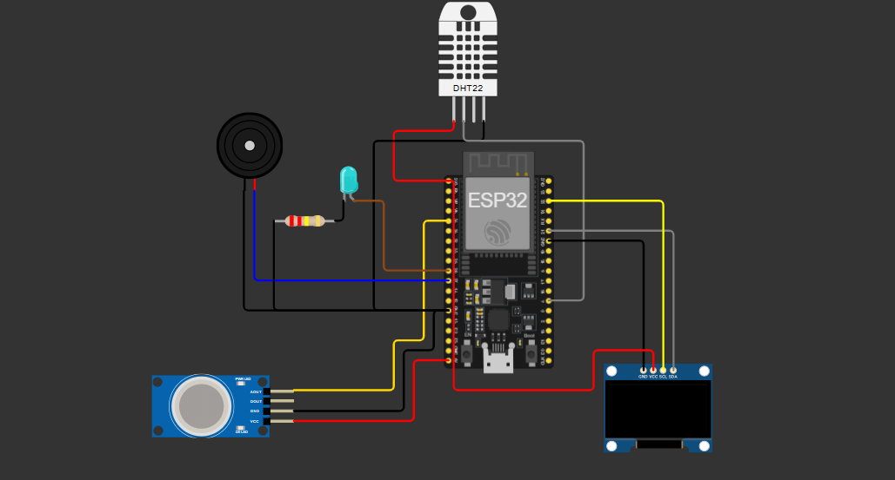
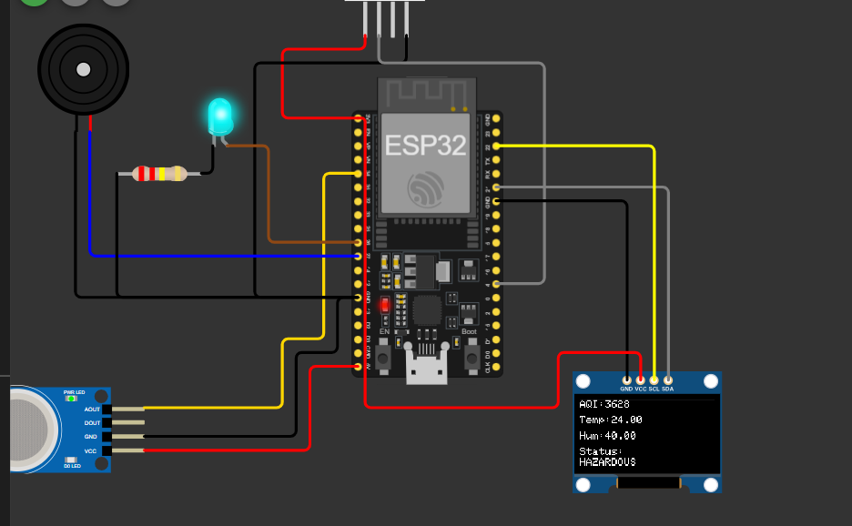
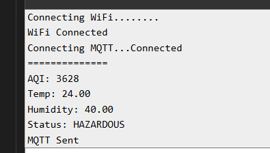
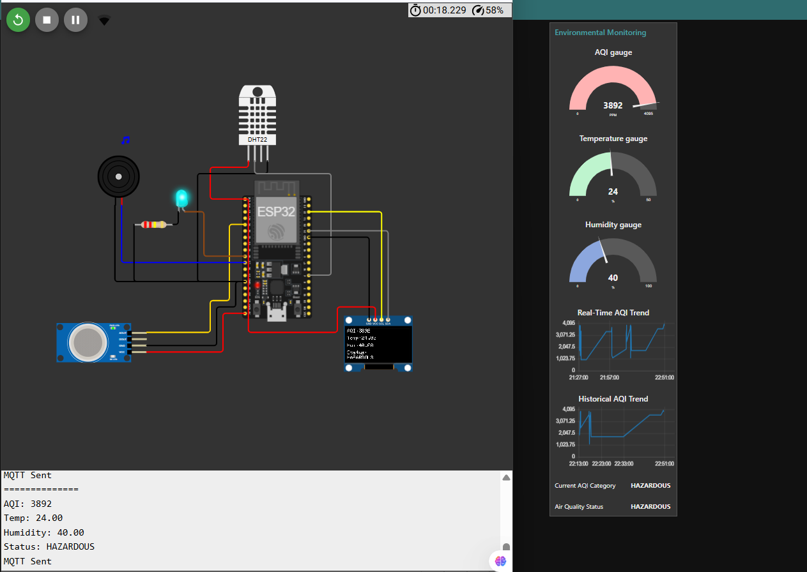
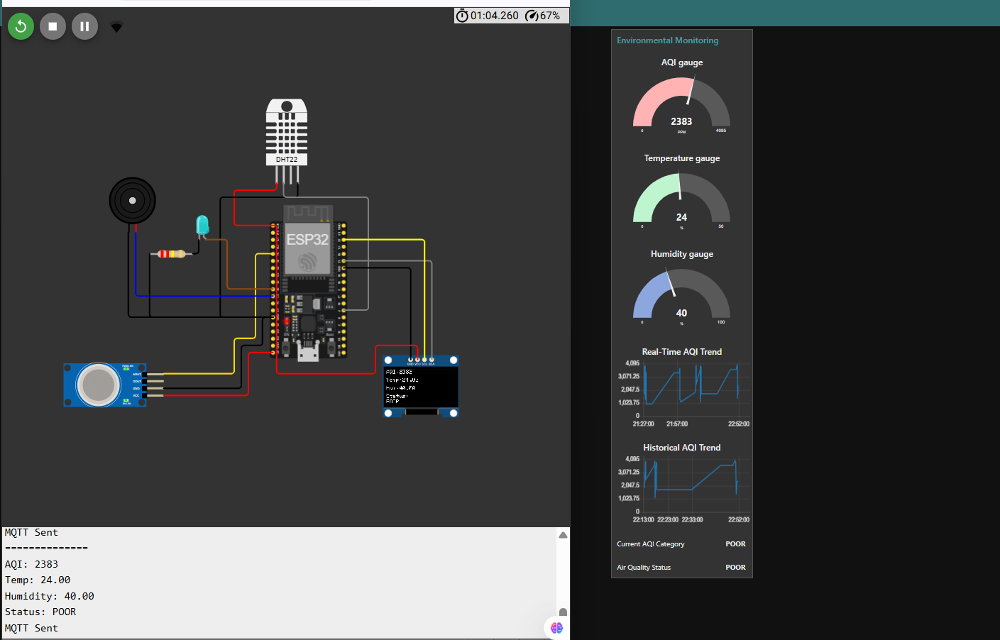
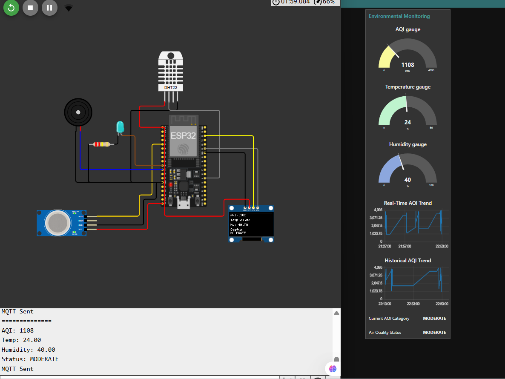
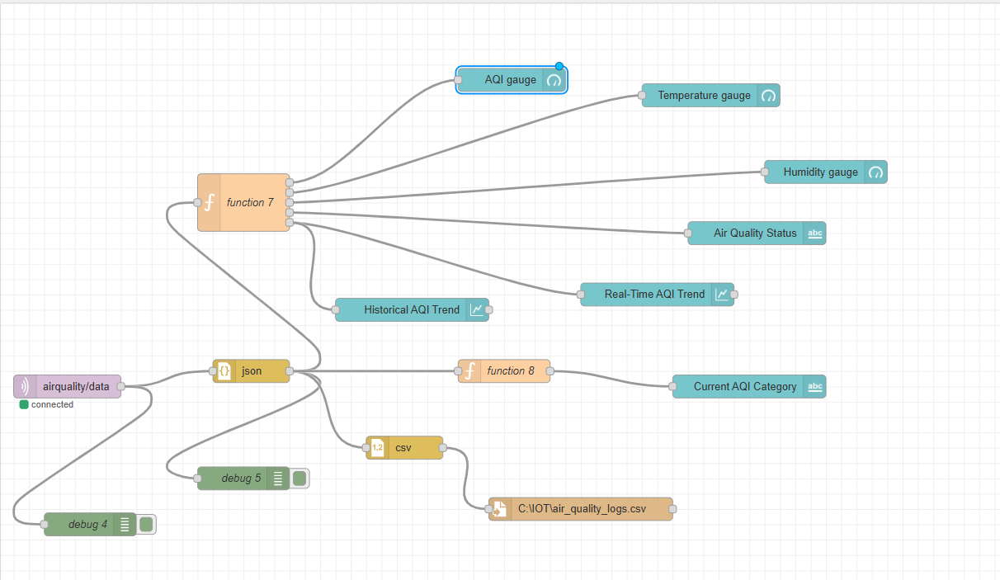

# 🌍 IoT-Based Air Quality & Pollution Monitoring Dashboard


## 🚀 Project Overview

An IoT-based Air Quality & Pollution Monitoring System that continuously measures:

- 🌫️ Air Quality Index (AQI)
- 🌡️ Temperature
- 💧 Humidity

The system uses an ESP32 microcontroller with MQ135 and DHT22 sensors to collect environmental data, display it on an OLED screen, and transmit it using MQTT to a Node-RED Dashboard for real-time visualization and analysis.

---

## 🎯 Features

✅ Real-Time Air Quality Monitoring

✅ Temperature Monitoring

✅ Humidity Monitoring

✅ OLED Display Visualization

✅ MQTT Communication

✅ Node-RED Dashboard

✅ AQI Classification

✅ Real-Time Trend Analysis

✅ Historical Trend Analysis

✅ CSV Data Logging

✅ Hazardous Air Quality Detection

---

## 🛠️ Tech Stack

| Technology | Purpose |
|------------|----------|
| ESP32 | Microcontroller |
| MQ135 | Air Quality Sensor |
| DHT22 | Temperature & Humidity Sensor |
| OLED SSD1306 | Display Module |
| MQTT | Communication Protocol |
| Mosquitto | MQTT Broker |
| Node-RED | Dashboard |
| Arduino IDE | Firmware Development |
| Wokwi | IoT Simulation |
| CSV | Data Logging |

---

## 🏗️ System Architecture

```text
MQ135 + DHT22
       │
       ▼
     ESP32
       │
       ▼
     MQTT Broker
       │
       ▼
    Node-RED
       │
 ┌─────┼─────┐
 ▼     ▼     ▼
OLED Dashboard CSV Logs
```

---

## 📂 Project Structure

```text
IoT-Air-Quality-Pollution-Monitoring-Dashboard
│
├── data
│   └── air_quality_logs.csv
│
├── docs
│   ├── Architecture_Diagram.png
│   ├── circuit_diagram.png
│   └── Project_Report.pdf
│
├── esp32_code
│   └── esp32_air_quality_monitor.ino
│
├── images
│   ├── 01_wokwi_circuit.png
│   ├── 02_oled_display.png
│   ├── 04_mqtt_connected.png
│   ├── 06_dashboard_hazardous.png
│   ├── 06_dashboard_poor.png
│   ├── 07_dashboard_moderate.png
│   └── 08_aqi_chart.png
│
├── node_red
│   └── air_quality_flow.json
│
├── .gitignore
├── requirements.txt
└── README.md
```

---

## 📊 AQI Classification

| AQI Range | Status |
|------------|---------|
| 0 – 999 | 🟢 GOOD |
| 1000 – 1999 | 🟡 MODERATE |
| 2000 – 2999 | 🟠 POOR |
| 3000 – 4095 | 🔴 HAZARDOUS |

---
## 📷 Project Screenshots

### 🔌 Wokwi Circuit



---

### 📺 OLED Display



---

### 📡 MQTT Communication



---

### 🔴 Dashboard - Hazardous AQI



---

### 🟠 Dashboard - Poor AQI



---

### 🟡 Dashboard - Moderate AQI



---

### 📈 AQI Trend Analysis



---

---

## 🚀 How to Run

### 1. Clone Repository

```bash
git clone https://github.com/sujalkrshaw/IoT-Air-Quality-Pollution-Monitoring-Dashboard.git
```

### 2. Start MQTT Broker

```bash
mosquitto -v
```

### 3. Import Node-RED Flow

Import:

```text
node_red/air_quality_flow.json
```

### 4. Upload ESP32 Code

Open:

```text
esp32_code/esp32_air_quality_monitor.ino
```

Upload to ESP32.

### 5. Open Dashboard

```text
http://localhost:1880/ui
```

---

## 📈 Results

✅ Real-Time Monitoring

✅ MQTT Data Transmission

✅ OLED Visualization

✅ Interactive Dashboard

✅ Historical AQI Analysis

✅ CSV Data Logging

✅ Air Quality Classification

---

## 🎓 Learning Outcomes

This project helped develop practical skills in:

- Internet of Things (IoT)
- Embedded Systems
- ESP32 Programming
- MQTT Protocol
- Node-RED Dashboard Development
- Data Logging
- Sensor Integration
- Real-Time Monitoring Systems

---

## 🔮 Future Enhancements

- ☁️ Cloud Integration
- 📱 Mobile Application
- 📧 Email Alerts
- 📍 GPS-Based Pollution Mapping
- 🤖 AI-Based Pollution Prediction
- 📊 Advanced Analytics Dashboard

---

## 👨‍💻 Author

**Sujal Kumar Shaw**


💼 Open to Internship and Collaboration Opportunities

---

### ⭐ If you found this project useful, please give it a Star!

🚀 Built with ESP32 • MQTT • Node-RED • IoT
